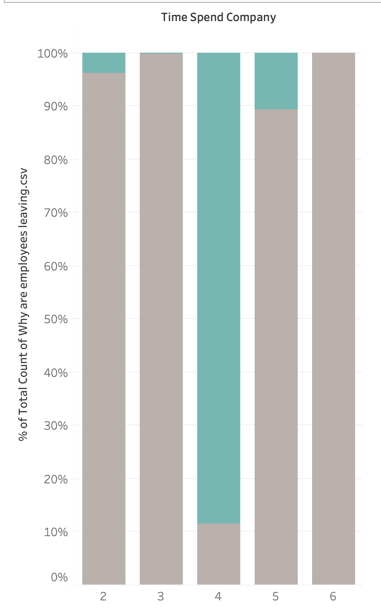
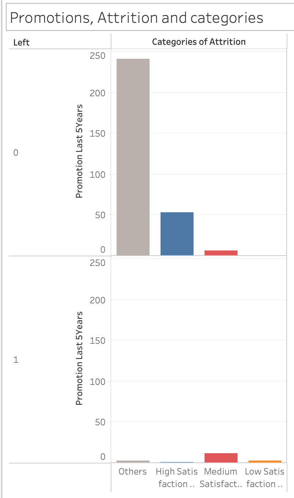

## Why are Employees Leaving? Understanding Employee Attrition Through Data ##
### Introduction ###
Employee attrition is a critical challenge for organizations striving to maintain a stable and productive workforce. This analysis delves into key factors influencing employee turnover, using **exploratory data analysis (EDA)** to uncover meaningful patterns. By examining attributes such as **job satisfaction, salary levels, promotions, work hours, and project workload**, this report aims to provide **data-driven insights** into why employees leave and what can be done to improve retention.

Through **visualizations and statistical analysis**, Idea is to identify trends that distinguish employees who stay from those who exit. The goal is to **equip decision-makers with actionable insights** to enhance employee engagement, optimize HR policies, and foster a more resilient workforce.

**Please go through the md file labelled "Understanding the Data" to clearly grasp what the data contains. Understanding of the report is dependent on that knowledge.**

### A Preliminary Overview at the company level ###
To begin with, we can answer some basic questions with relation to the employees who are leaving. The total number of people who left the organisation is 3,571 out of 14,999 members (~ 23.8% ). Viewing the attrition per Division reveals no major insights. Apart from two divisions with markedly lower attrition rate, rest all divisions are more or less similar.

{width="100"}

Attrition based on the salary class suggests that salary, though is a factor, is not the only factor. A meaningful conclusion cannot be derived from the observations as the trend of lower salaried people attritioning in the hopes of higher pay outside is in line with expectations. An organisation cannot afford to simply increase salaries to retain all employees.

The number of employees with workplace accidents is too few to glean clear information of the influence of this parameter.

We now begin diving deeper into the data to find other factors that can influence attrition and see if they can yield any good results. Analysis based purely on single metric at a time obscures or averages out finer details.

### Employee Satisfaction and Supervisor Evaluation ###
#### Why Satisfaction and Evaluation ####
**Employee Satisfaction - An employee's perspective of the work:** Beyond monetary terms, satisfaction is one of the most important metrics that decides whether a person is likely to stay or leave an organisation. 
**Supervisor Evaluation - Organisaions perspective the work:** Given that the attrition also impacts the output of the organisation as a whole, evaluation by supervisors also emerges as an important measure to understand the relative contributions of a specific employee.

Tracking these two would give an idea of how an employee feels about their individual work and situation in the company and how the organisation values that work. An interplay between these two can be a big motivator for attrition.

#### Clear Patterns begin to emerge ####

We see three dominating clusters forming. We can categorise the clusters into three categories accordingly
1. High Evaluation Low Satisfaction => They are rated highly but they are not satisfied with their situation.
2. High Evaluation High Satisfaction => They are rated highly and they are satisfied with their situation
3. Low Evaluation Medium Satisfaction => They are not rated highly and have normal satisfaction

Clusters are coloured as per the above categorisation.

### Not all attrition is bad! - Shortlisting Clusters for further analysis ###
Companies would like to have some attrition to weed out non performers and bring in fresh blood. As such, it is important to pick and choose what clusters need to be focused upon for detailed analysis. Based on this, it is important to consider 2 clusters out of the three to analyse further. These clusters are both the ones with high evaluation, meaning that their absence is worse felt by the organisation relatively. Employee retention policies should be focussed on such high performers if the company doesn't want to let go of these people.

### Cluster 1 : High Evaluation but Low Satisfaction
A customary analysis of division and salary influence on this cluster reveals they dont play any bigger role in this cluster compared to the overall population.

Comparing the **efforts and rewards** for this cluster vis-a-vis the general population yields interesting facts. 
1. Amongst the people who left the company, this cluster tends to have higher average monthly hours and higher number of projects.

 

1. Another look based on the average hours of people belonging to this category reveals that, this category has a very high average monthly hours compared to any other grouping and that **all** such people left the organisation, evident from the lack of average hours of people in the cluster who stayed.

1. There is a **lack of promotions** for this group, compared to the rest of the population.

1. Comparing the time spent in the company, this group is middling. As such, this metric may not be an important factor in determining attrition for this cluster

### Cluster 2 : High Evaluation and High Satisfaction
A customary analysis of division and salary influence on this cluster reveals they dont play any bigger role in this cluster compared to the overall population.

Comparing the **efforts and rewards** for this cluster vis-a-vis the general population yields interesting facts. 
1. Amongst the people who left the company, this cluster tends to have moderate average monthly hours and moderate number of projects.

2. A curious thing is observed in this group that those who were promoted largely stayed whilst those who left didnt contain manu promotees. This makes this metric an important factor to decide attrition

1. Comparing the time spent in the company, this group contains employees with the **highest longevity**. As such, this metric may be an important factor in determining attrition for this cluster.

### Conclusions from the EDA
#### Cluster 1 : High Evaluation but Low Satisfaction
The main cause of attrition for the group is heavy workload combined with lack of promotions. The employees in this cluster experience high evaluation and the highest amount of work yet do not see their work rewarded and translated into promotions, prompting them to leave with Low Satisfaction. 

#### Cluster 2 : High Evaluation and high Satisfaction
The main cause of attrition for the group is the lack of promotions coupled with long time spent in the company. The employees in this cluster experience high evaluation and moderate workload. The cluster is highly satisfied and lack of promotions for longer periods of working in the same company seem to be the driving cause of attrition as we can see that once promotions are given, the employees in this category are largely likely to stay

#### Recommendations for the organsation
1. A thorough review of promotion policy is required. Most of the attrition of highly evaluated people occurs due to poor promotion policies which made the promotions percolating to these high performing clusters very low

### **Summary - Key Takeaways**
- Employee attrition is **not uniform** across divisions but is mainly influenced by **workload and promotions**.
- **Heavy workload without promotions** is one of the major drivers of attrition among **high performers**.
- **Long tenure without promotions** also increases the likelihood of employees leaving.
- **Recommendation**: The company should review its **promotion policies** to retain top talent.

